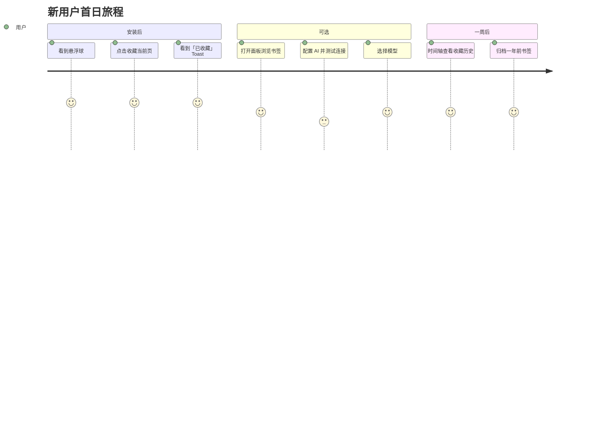

# AI 书签管家 v3.0 — 产品需求文档（体验打磨版）

| 字段 | 内容 |
|------|------|
| 文档版本 | v3.0 Draft |
| 创建日期 | 2026-07-16 |
| 产品名称 | AI 书签管家（BookmarkMind AI） |
| 文档状态 | **待评审** — 由产品视角主导，研发暂不排期 |
| 前置文档 | `AI书签管家_PRD_v2_落地版.md`（功能已交付）、用户实测反馈（2026-07-16） |
| 目标读者 | 产品、设计、研发、QA |
| 撰写视角 | 产品经理（用户便利优先，功能克制） |

---

## 0. 一句话定位（Press Release 测试）

> **AI 书签管家不是「更复杂的书签管理器」，而是「收藏时省心、找的时候省力、久了也不乱」的浏览器伴侣。**
>
> 用户不需要理解 AI、文件夹、标签的区别——他们只需要：点一下能收藏，找一下能找到，久了能清理，不会突然报错。

若用户读完这句话仍不清楚「我为什么要用」，则本 PRD 所描述的方向不应进入开发。

---

## 1. 问题陈述

### 1.1 从 v2 交付到 v3 的转折

v2 已完成 6 个 P0 能力（清理、再发现、时间轴、标签底层、备注高亮等），**功能覆盖面够了，但「好用」不够**。

近期真实反馈可归为四类：

| 反馈主题 | 用户原话（意译） | 本质问题 |
|----------|------------------|----------|
| 收藏报错 | 点悬浮球出现 503，不知道是否配置模型 | **结果不透明**：用户分不清「收藏失败」还是「AI 失败」 |
| 模型配置 | 测试连接后有模型列表，但不知道怎么选 | **引导断裂**：技术能力有了，用户路径没闭环 |
| 时间轴治理 | 希望能按时间批量删老书签，删除前要确认 | **治理缺入口**：能看不能管 |
| 分类混乱 | GitHub / 文章 / 网站混在一起；老书签该归档 | **心智模型缺失**：用户不知道「文件夹 vs 标签 vs 类型」各干什么 |

### 1.2 核心命题（v3）

> **功能可以少，但路径必须清；AI 可以慢，但收藏不能挂。**

### 1.3 不解决的成本

- 用户把 503 理解为「扩展坏了」→ 卸载
- 标签能力存在但找不到入口 → 功能等于没做
- 时间轴只能看不能清理 → 用户继续不敢多收藏
- 智能分组越分越乱 → 用户关掉「自动分类」

---

## 2. 目标与非目标

### 2.1 用户目标

| # | 目标 | 衡量方式 |
|---|------|----------|
| U1 | 用户无需配置 AI 也能完成核心收藏 | 无 API Key 用户 7 日收藏成功率 ≥ 95% |
| U2 | 用户能分清「收藏成功」与「AI 增强失败」 | 相关支持类困惑反馈下降 50% |
| U3 | 用户能在 3 次点击内完成「查看 → 筛选 → 确认删除」老书签 | 时间轴治理任务完成率 ≥ 60% |
| U4 | 用户理解文件夹、标签、内容类型各自用途 | 新用户引导完成率 ≥ 70% |

### 2.2 业务目标

| # | 目标 | 衡量方式 |
|---|------|----------|
| B1 | 降低首周卸载率 | 安装后 7 日卸载率 < 30% |
| B2 | 提升「敢收藏」心智 | 人均周收藏次数 +20% |

### 2.3 非目标（v3 明确不做）

- ❌ 不做新的 AI 能力（图谱、复杂 Agent、多轮规划）
- ❌ 不做跨浏览器同步
- ❌ 不做付费体系
- ❌ 不追求「全自动删书签」— 所有删除必须用户确认
- ❌ 不重构 v2 已交付模块的底层架构（除非为体验修复所必需）

---

## 3. 用户画像

### 3.1 主画像：「怕乱收藏家」小林

- 书签 200～2000 个，Chrome 原生文件夹已放弃管理
- **核心焦虑**：「再收藏就更乱」「删了怕后悔」
- **耐心极低**：悬浮球点一下没反应 → 立刻判定产品坏了
- **对 AI 无感**：只想收藏和找到，不想配 API

### 3.2 次画像：「效率型开发者」阿辰

- 大量 GitHub / 文档 / 技术文章
- 希望 **按类型 + 标签** 区分，而不是几十个相似文件夹
- 愿意配置模型，但讨厌「测试成功却不知道选哪个模型」

### 3.3 反画像（不优先服务）

- 需要团队级书签协作的企业用户
- 把扩展当「第二大脑」做复杂知识图谱的用户（v3 不服务）

---

## 4. 产品原则（体验宪法）

以下原则优先级高于任何单点功能需求：

1. **收藏优先于智能** — 本地 Chrome 书签写入是第一性原理；AI 是增强层，失败不得阻断收藏。
2. **一次点击一种结果** — 每个操作只给用户一个明确结论（成功 / 失败 / 部分成功），禁止模糊 Toast。
3. **渐进式复杂度** — 默认简单（一键收藏）；高级能力（标签、备注、AI 分类）通过「更多选项」展开。
4. **删除必确认、归档优先于删除** — 批量治理默认建议「归档」，删除是显式二次确认动作。
5. **三层信息架构不混用** — 内容类型（是什么）≠ 文件夹（放哪）≠ 标签（怎么找）。

---

## 5. 信息架构：文件夹 / 标签 / 内容类型

用户困惑的根源是 **三套体系职责重叠**。v3 统一口径：

| 维度 | 回答的问题 | 谁维护 | 用户是否必须理解 |
|------|------------|--------|------------------|
| **内容类型** | 这是什么？（GitHub / 文章 / 文档 / 视频 / 工具 / 其他） | 规则自动识别 + AI 辅助 | 可见但不强制编辑 |
| **文件夹** | 放在哪？（开发 / 阅读 / 归档…） | AI 建议 + 用户可改 | 必须（Chrome 原生） |
| **标签** | 怎么搜？（react, 待读, 教程…） | 用户 + AI 建议 | 可选，但强烈鼓励 |

**展示原则**：
- 列表主视图：标题 + 类型图标 + 1～2 个标签
- 文件夹只在「书签」Tab 的分类栏展示
- 不在同一行堆 3 种信息

---

## 6. 功能需求

### F1. 收藏体验重构（P0 — 最高优先）

**问题**：用户点击悬浮球遇到 503，误以为不能收藏。

**方案**：

```
用户点击悬浮球（默认：快速收藏）
  ├─ Step 1: chrome.bookmarks.create（必须成功才显示「已收藏」）
  ├─ Step 2: 若开启自动分类且 AI 可用 → 异步分类（失败静默）
  └─ Step 3: Toast 分级
        ├─ 全成功：「已收藏，归入「开发」」
        ├─ 收藏成功 / AI 失败：「已收藏（智能分类暂不可用）」
        └─ 收藏失败：「收藏失败：[具体原因]」— 绝不显示裸 503
```

**用户故事**：

> 作为未配置 AI 的小林，我想点击悬浮球就能收藏当前页，以便我不必先去设置页。

**验收标准**：
- [ ] 无 API Key 时收藏成功率 ≥ 99%（仅受 Chrome API 限制）
- [ ] AI 分类超时 / 503 时，书签仍存在于 Chrome 书签栏
- [ ] Toast 文案不出现未解释的技术错误码（503 转为「AI 服务暂时不可用」）
- [ ] 设置页可一键关闭「自动分类」，关闭后收藏路径无 AI 调用

**非目标**：v3 不改变「单击 = 快速收藏」的默认行为（双击/长按打开高级面板可放 P1）。

---

### F2. 模型配置引导闭环（P0）

**问题**：测试连接返回模型列表，用户不知道下一步。

**方案**：
1. 测试成功 → 模型字段自动切换为**下拉选择**（已实现，需纳入体验验收）
2. 首次成功后在模型字段下方显示：「已检测到 N 个模型，请选择一个作为默认」
3. 未选择模型时，AI 功能入口显示「请先选择模型」，但**不影响收藏**

**验收标准**：
- [ ] 测试成功后 5 秒内用户能看到可选模型列表
- [ ] 切换服务商时清空旧列表，避免误导
- [ ] 帮助文案区分：「不配置 AI = 可以收藏；配置 AI = 可以智能分类和对话」

---

### F3. 标签体系产品化（P0）

**问题**：标签 CRUD 已实现，但用户找不到「标签管理」。

**方案**：

| 入口 | 能力 |
|------|------|
| 书签 Tab 顶部 | 「标签」筛选 chips（已有）+ 新增「管理标签」入口 |
| 书签详情 | 编辑标签（已有） |
| 收藏确认弹窗 | 选标签 + AI 建议标签（已有，需接到更多收藏路径） |
| 设置页 | 标签管理（迁移 TagManager 组件） |

**收藏路径分级（P0 只做说明，P1 做交互）**：

| 操作 | 行为 |
|------|------|
| 单击悬浮球 | 快速收藏（不打标签） |
| 面板底部「收藏当前页」 | 打开确认弹窗（可选文件夹 + 标签 + 备注） |

**AI 打标签规则**：
- 收藏时若 AI 可用，建议 2～3 个标签（不自动创建超过 5 字的中文标签名）
- 用户不选则不强制

**验收标准**：
- [ ] 新用户能在 30 秒内找到标签管理入口
- [ ] 带标签收藏后，书签 Tab 可按标签筛选到该书签

---

### F4. 时间轴治理工具栏（P1）

**问题**：时间轴能看历史收藏，但无法基于时间做治理。

**方案**：在时间轴筛选区下方增加 **「快捷治理」** 条：

| 按钮 | 行为 | 安全 |
|------|------|------|
| 切换分组 | 按时间 / 按站点 / 按内容类型 | 仅视图切换 |
| 归档 N 年前 | 移入「📦 历史归档」文件夹 | 确认弹窗 + 数量预览 |
| 删除 N 年前 | 删除符合筛选的书签 | **二次确认** + 数量预览 + 回收站提示 |
| 仅看无标签 | 筛选未打标签 | 方便补标 |

**删除一年前书签的标准流程**：

```
点击「删除 1 年前」
  → 弹窗：「将删除 127 个书签（2024-07-16 之前）」
  → 选项：[取消] [先导出 CSV] [移入归档] [确认删除]
  → 若开启回收站：「删除后 30 天内可在设置 → 数据管理恢复」
```

**验收标准**：
- [ ] 删除前必须展示精确数量
- [ ] 默认高亮「移入归档」而非「删除」（归档优先原则）
- [ ] 删除操作可撤销（回收站开启时）

**非目标**：v3 不做基于浏览历史的「智能判断该不该删」（需 history 权限，放 P2 评估）。

---

### F5. 智能分类 v2：类型感知 + 老书签归档（P1）

**问题**：GitHub、文章、网站混在一个文件夹体系里；老书签和新书签同一标准。

**方案**：

**5.1 内容类型（规则优先，AI 兜底）**

| 类型 | 识别规则（v3 第一版） |
|------|----------------------|
| GitHub | `github.com` / `gist.github.com` |
| 文章 | 常见博客域名 + 页面含 `article` 标签（可选） |
| 文档 | `docs.` / `readme` / `notion.site` / PDF |
| 视频 | `youtube.com` / `bilibili.com` |
| 工具 | 已知 SaaS 域名表（可配置） |
| 其他 | 兜底 |

类型显示为图标，**不强制创建类型文件夹**（避免文件夹爆炸）。

**5.2 文件夹分类（AI，克制）**

- 主题文件夹保持 6～10 个上限：开发、设计、阅读、工具、资讯、生活、**历史归档**、其他
- 新建文件夹需置信度 ≥ 0.7
- **GitHub 仓库不单独建文件夹**，用类型图标 + 标签 `github` 区分

**5.3 老书签策略**

```
若 收藏时间 > 1 年
且 无备注、无高亮、无标签
→ 一键整理时建议移入「历史归档」，不自动删除
→ 时间轴显示「可归档 N 个」提示条
```

**验收标准**：
- [ ] 一键整理后 GitHub 书签不会每人一个文件夹
- [ ] 用户能在书签列表看到内容类型图标
- [ ] 「历史归档」文件夹在设置页可重命名/清空

---

### F6. 首次使用引导（P1）

**3 步引导（可跳过）**：

1. 「点悬浮球即可收藏，无需配置 AI」
2. 「配置 AI 后可智能分类和对话搜索」（跳转设置）
3. 「用标签比文件夹更灵活找书签」（展示标签入口）

**验收标准**：
- [ ] 引导可在设置中重新打开
- [ ] 跳过引导不影响任何功能

---

## 7. 用户旅程（v3 目标态）



---

## 8. 优先级与 RICE 评分

| 功能 | Reach | Impact | Confidence | Effort | RICE | 建议排期 |
|------|-------|--------|------------|--------|------|----------|
| F1 收藏体验重构 | 100% | 3 | 90% | S | **270** | **v3.0 首发** |
| F2 模型引导闭环 | 40% | 2 | 85% | S | 68 | v3.0 首发 |
| F3 标签产品化 | 60% | 2 | 80% | M | 64 | v3.0 首发 |
| F4 时间轴治理 | 50% | 2 | 75% | M | 50 | v3.1 |
| F5 智能分类 v2 | 50% | 2 | 60% | L | 24 | v3.1 |
| F6 首次引导 | 100% | 1 | 70% | S | 70 | v3.1 |

---

## 9. 成功指标

| 指标 | 当前（估） | v3 目标 | 观测窗口 |
|------|-----------|---------|----------|
| 无 AI 配置用户的收藏成功率 | 未知 | ≥ 95% | 上线 30 天 |
| 「收藏失败」类反馈 | 有 | 下降 70% | 上线 60 天 |
| 标签功能发现率 | 低 | ≥ 30% 用户使用过标签 | 上线 60 天 |
| 7 日留存 | ~15% | ≥ 25% | Q3 |
| 时间轴治理功能使用率 | 0 | ≥ 15% 活跃用户 | v3.1 后 30 天 |

---

## 10. 风险与对策

| 风险 | 对策 |
|------|------|
| 功能做多了又「不好用」 | 每个版本最多 3 个 P0，其余进 backlog |
| 归档/删除误操作 | 归档优先 UI；删除二次确认；回收站默认开启 |
| 类型识别不准 | 规则优先，用户可手动改类型（P2） |
| AI 成本 | 快速收藏路径默认不调 AI |

---

## 11. 开放问题（评审前需决议）

| # | 问题 | 建议 | 决策人 |
|---|------|------|--------|
| Q1 | 单击悬浮球是否改为「打开收藏弹窗」？ | 保持单击快速收藏；双击/长按打开弹窗 | 产品 |
| Q2 | 是否申请 `history` 权限做「久未访问」判断？ | v3 不做，v4 再评估 | 产品 + 法务 |
| Q3 | 「历史归档」是否系统保留文件夹名？ | 是，不可被 AI 整理打散 | 产品 |
| Q4 | Chrome Web Store 上架前是否隐藏未产品化的 Tab？ | 隐藏开发中 Tab，只保留书签/对话/清理 | 产品 |

---

## 12. 我们刻意不做的事（含本次用户建议）

以下想法**有价值，但 v3 不实现**，避免范围膨胀：

| 用户建议 | 处理方式 |
|----------|----------|
| 时间轴快捷删一年前 | ✅ 纳入 F4，但 P1，且归档优先 |
| GitHub/文章/网站区分 | ✅ 纳入 F5 类型图标，不做无限文件夹 |
| 标签 + AI 打标 | ✅ 纳入 F3，先补入口 |
| 悬浮球 503 | ✅ 纳入 F1，定位为体验 Bug 非架构问题 |
| 更复杂的 Agent 能力 | ❌ v3 不做 |
| 基于浏览历史的自动删除 | ❌ v3 不做，需权限与隐私评审 |

---

## 13. 里程碑建议

| 版本 | 范围 | 预期 |
|------|------|------|
| **v3.0** | F1 + F2 + F3 | 让用户「能收藏、能配模型、能找到标签」 |
| **v3.1** | F4 + F5 + F6 | 让用户「能治理老书签、分类不乱」 |
| **v3.2** | 数据驱动迭代 | 根据留存与反馈微调 |

---

## 14. 附录：现有能力与缺口对照

| 能力 | 代码状态 | 产品化状态 | v3 动作 |
|------|----------|------------|---------|
| 一键收藏 | ✅ | ⚠️ 错误提示混淆 | F1 修复 |
| 模型列表选择 | ✅ | ⚠️ 引导不足 | F2 补文案 |
| 标签 CRUD | ✅ | ❌ 入口隐藏 | F3 接入口 |
| 时间轴 | ✅ | ❌ 只读 | F4 加快捷治理 |
| 智能分类 | ✅ | ⚠️ 易混乱 | F5 加类型层 |
| 再发现 / 清理 | ✅ | ✅ 可用 | 维持，不扩 scope |

---

## 15. 评审检查清单

评审会上请逐条确认：

- [ ] 是否同意「收藏不依赖 AI」作为 v3 第一原则？
- [ ] F1～F3 是否作为 v3.0 唯一开发范围？
- [ ] 时间轴删除是否必须坚持「归档优先于删除」？
- [ ] 标签与文件夹的用户教育文案谁负责（产品 + 设计）？
- [ ] 是否需要在 Chrome Web Store 上架前做功能裁剪？

---

*本文档由产品视角撰写，聚焦「用户使用方便」。技术实现细节见 `AI书签管家_v2_架构设计.md`，不在此重复。待评审通过后，再拆分为研发任务单。*
