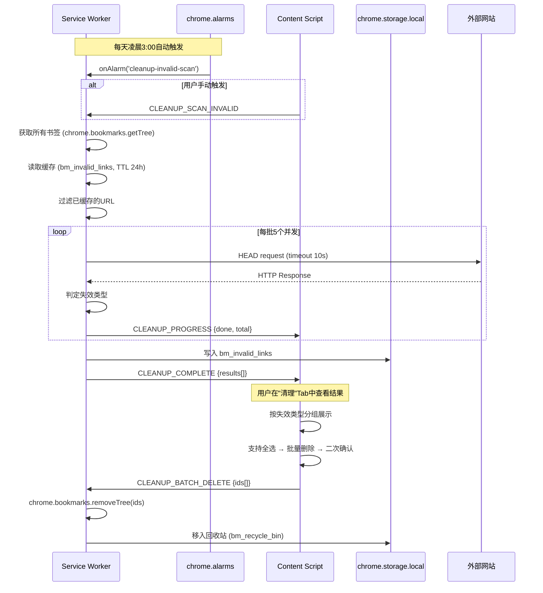
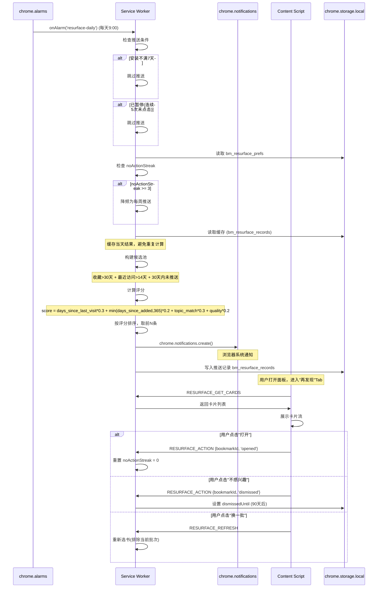
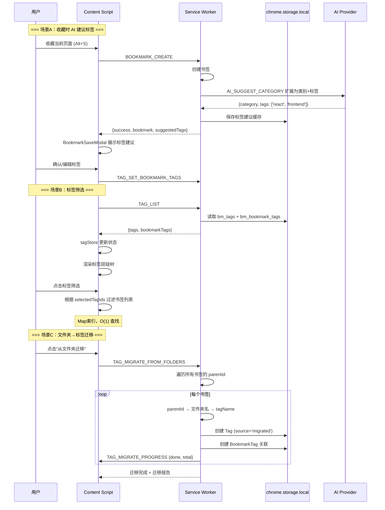

# AI 书签管家 v2.0 — 增量架构设计文档

| 字段 | 内容 |
|------|------|
| 文档版本 | v1.0 |
| 创建日期 | 2026-07-16 |
| 架构师 | 高见远 |
| 状态 | Ready for Review |
| 关联文档 | `AI书签管家_PRD_v2_落地版.md`、v1 代码库 `bookmarkmind-ai/` |

---

## 目录

1. [实现方案概述](#1-实现方案概述)
2. [文件列表及相对路径](#2-文件列表及相对路径)
3. [数据结构和接口](#3-数据结构和接口)
4. [模块调用流程](#4-模块调用流程)
5. [任务列表](#5-任务列表)
6. [依赖包列表](#6-依赖包列表)
7. [共享知识（跨文件约定）](#7-共享知识跨文件约定)
8. [待明确事项](#8-待明确事项)

---

## 1. 实现方案概述

### 1.1 架构整体方案

v2 采用 **增量改动** 策略，在 v1 已有三层架构（交互层 / 核心功能层 / AI 引擎层 / 数据层）上扩展：

| 层级 | v1 已有 | v2 新增 | 策略 |
|------|---------|---------|------|
| 交互层 | 对话Tab、书签Tab | 清理中心Tab、时间轴Tab、再发现Tab | 新增Tab组件，复用Panel容器 |
| 核心功能层 | 收藏/搜索/分类/批量 | 失效检测、重复检测、再发现引擎、标签系统、备注/高亮 | 新增background模块，通过消息路由集成 |
| AI 引擎层 | 对话/搜索/分类 Prompt | 标签建议Prompt | 扩展现有Prompt构建器 |
| 数据层 | chrome.bookmarks | Tags、Notes、Highlights、InvalidLinks、Resurface | chrome.storage.local 新增存储键 |
| 定时任务层 | 无 | chrome.alarms + chrome.notifications | 新增scheduler模块 |

**核心原则**：
- **修改已有文件时使用最小变更原则**：对 v1 文件的修改仅限于添加新消息类型、扩展类型定义、扩展 Store 状态
- **新增功能用独立模块**：每个 P0 功能的 background logic 用独立文件，不侵入 v1 模块
- **UI 用新 Tab 组件**：新增视图作为新 Tab 组件，通过 PanelTabs 统一路由

### 1.2 框架/库选型

**无需引入新 npm 依赖**。v1 已有技术栈完全覆盖 v2 需求：

| 需求 | 方案 | 说明 |
|------|------|------|
| 失效检测 HTTP 请求 | `fetch` API（v1 已用） | v1 已有 `handleBrokenLinkCheck`，增强即可 |
| 定时任务 | `chrome.alarms` API | Manifest 已声明 `alarms` 权限 |
| 推送通知 | `chrome.notifications` API | 需新增 permissions 声明 |
| 标签数据 CRUD | `chrome.storage.local` + Map 索引 | 纯内存操作，无需 DB |
| 虚拟滚动 | `@tanstack/react-virtual`（v1 已有） | 时间轴/失效列表复用 |
| UUID 生成 | `crypto.randomUUID()` | 浏览器原生 API，无需 uuid 包 |
| Tab 图标 | `lucide-react`（v1 已有） | Archive, Clock, Trash2, Tag, Sparkles 等 |

### 1.3 与 v1 的兼容性策略

#### 数据迁移

| 场景 | 策略 | 实现 |
|------|------|------|
| v1 用户升级到 v2 | 旧配置自动兼容 | `bm_config` 新增字段用默认值填充，不破坏已有结构 |
| 标签系统首次启用 | 文件夹名 → 初始标签 | 用户手动触发迁移，展示进度条 |
| 再发现首次推送 | 安装满 7 天才推送 | 通过 `chrome.runtime.onInstalled` 记录 installDate |

#### 配置兼容

- `DEFAULT_CONFIG` 结构不变，v2 新增配置项（如 `ResurfacePrefs`、标签模式）存储为独立键
- `AppSettings` 扩展 `tagMode` 字段，默认值 `'coexist'`（标签与文件夹并存）

#### Manifest 权限变更

```typescript
// 需新增的权限
permissions: [
  // ... 已有权限
  'notifications',  // F3 再发现推送
]
```

**注意**：`alarms` 权限 v1 已声明，无需修改。

---

## 2. 文件列表及相对路径

### 2.1 新增文件

| 模块 | 文件路径 | 说明 |
|------|----------|------|
| **Background — 清理中心** | | |
| background | `src/background/cleanup/invalid-links.ts` | 失效链接检测：HEAD 请求、分类判定、结果缓存 |
| background | `src/background/cleanup/duplicates.ts` | 重复书签检测：URL 归一化、标题匹配、分组 |
| **Background — 再发现** | | |
| background | `src/background/resurface/scorer.ts` | 再发现评分算法：候选池筛选、加权评分 |
| background | `src/background/resurface/engine.ts` | 再发现引擎：选书、推送编排、反打扰逻辑 |
| **Background — 标签系统** | | |
| background | `src/background/tags/crud.ts` | 标签/关联 CRUD：增删改查、合并、批量操作 |
| background | `src/background/tags/migrate.ts` | 文件夹→标签迁移：进度回调、迁移报告 |
| **Background — 备注与高亮** | | |
| background | `src/background/notes/crud.ts` | 备注存储：增删改查 |
| background | `src/background/highlights/crud.ts` | 高亮存储：增删查 |
| **Background — 调度器** | | |
| background | `src/background/scheduler.ts` | chrome.alarms 定时任务 + chrome.notifications 推送管理 |
| **Content — 清理中心** | | |
| content | `src/content/components/CleanupTab/CleanupTab.tsx` | 清理中心主Tab：子Tab切换（失效/重复） |
| content | `src/content/components/CleanupTab/CleanupSubTabs.tsx` | 清理中心子Tab导航 |
| content | `src/content/components/CleanupTab/InvalidLinksList.tsx` | 失效链接列表：分组展示、批量操作、导出CSV |
| content | `src/content/components/CleanupTab/DuplicateGroups.tsx` | 重复书签组：展开详情、保留策略选择 |
| **Content — 时间轴** | | |
| content | `src/content/components/TimelineTab/TimelineTab.tsx` | 时间轴主视图：分组渲染、虚拟滚动 |
| content | `src/content/components/TimelineTab/TimelineGroup.tsx` | 时间分组卡片：今天/昨天/上周/本月/更早 |
| content | `src/content/components/TimelineTab/TimelineFilters.tsx` | 时间轴顶部过滤器：分类/标签/时间范围/搜索 |
| **Content — 再发现** | | |
| content | `src/content/components/ResurfaceTab/ResurfaceTab.tsx` | 再发现卡片流：无限滚动、换一批 |
| content | `src/content/components/ResurfaceTab/ResurfaceCard.tsx` | 再发现单卡片：操作按钮、反馈交互 |
| **Content — 标签管理** | | |
| content | `src/content/components/TagManager/TagManager.tsx` | 标签管理面板：创建/重命名/删除/合并 |
| content | `src/content/components/TagManager/TagChip.tsx` | 标签 Chip 组件：彩色标签、可删除 |
| content | `src/content/components/TagManager/TagSelector.tsx` | 标签选择器：搜索、多选、新建 |
| **Content — 书签详情** | | |
| content | `src/content/components/BookmarkTab/BookmarkDetail.tsx` | 书签详情侧栏：备注+高亮+标签编辑 |
| content | `src/content/components/BookmarkTab/NoteEditor.tsx` | Markdown 备注编辑器 |
| content | `src/content/components/BookmarkTab/HighlightList.tsx` | 高亮片段列表：引用样式展示 |
| **Content — Hooks** | | |
| content | `src/content/hooks/useCleanup.ts` | 清理中心数据获取 Hook |
| content | `src/content/hooks/useTimeline.ts` | 时间轴数据分组 Hook |
| content | `src/content/hooks/useResurface.ts` | 再发现数据获取 Hook |
| content | `src/content/hooks/useTags.ts` | 标签数据 Hook |
| **Content — Stores** | | |
| content | `src/content/store/cleanupStore.ts` | 清理中心状态：扫描进度、结果列表、过滤 |
| content | `src/content/store/resurfaceStore.ts` | 再发现状态：卡片列表、加载状态、用户操作 |
| content | `src/content/store/tagStore.ts` | 标签状态：标签列表、选中标签、筛选逻辑 |
| **Shared** | | |
| shared | `src/shared/utils/url.ts` | URL 工具函数：归一化、去 tracking 参数、域名提取 |

### 2.2 修改文件

| 模块 | 文件路径 | 修改要点 |
|------|----------|----------|
| Root | `src/manifest.ts` | 新增 `'notifications'` 权限 |
| Shared | `src/shared/types/index.ts` | 新增 8 个类型接口、6 个 STORAGE_KEYS、5 个 MessageTypes（详见第3章） |
| Background | `src/background/index.ts` | 1. import 新增模块 2. 新增消息路由 case（约5个） 3. 在 onInstalled 中初始化 scheduler 4. 新增 chrome.alarms.onAlarm 监听 |
| Content | `src/content/store/contentStore.ts` | 1. `activeTab` 类型扩展为 `'chat' \| 'bookmarks' \| 'timeline' \| 'cleanup' \| 'resurface' \| 'topic' \| 'graph' \| 'canvas'` 2. 新增 `viewPreferences` 状态 3. 新增 `viewPreferences` 持久化 action |
| Content | `src/content/components/FloatingPanel/PanelTabs.tsx` | 扩展为 6 个 Tab：对话/书签/时间轴/清理/再发现/图谱（P0 激活前 5 个，图谱灰色） |
| Content | `src/content/components/FloatingPanel/FloatingPanel.tsx` | 新增 TimelineTab / CleanupTab / ResurfaceTab 的条件渲染 |
| Content | `src/content/App.tsx` | 无显著变更（FloatingPanel 内部路由已处理） |
| Content | `src/content/components/BookmarkSaveModal/BookmarkSaveModal.tsx` | 新增备注输入框、标签选择器 |
| Content | `src/content/store/contentStore.ts` | `BookmarkSaveModalState` 扩展：新增 `note`、`suggestedTags` 字段 |
| Options | `src/options/store/optionsStore.ts` | 新增 `resurfacePrefs`、`tagMode` 等 v2 配置项的读写 |

---

## 3. 数据结构和接口

### 3.1 新增 TypeScript 类型定义

```typescript
// ============================================================
// v2 新增 — 失效链接检测
// ============================================================

export type InvalidLinkStatus =
  | 'invalid_404'
  | 'invalid_5xx'
  | 'invalid_redirect'
  | 'invalid_dns'
  | 'invalid_timeout'
  | 'invalid_content_deleted';

export interface InvalidLinkRecord {
  bookmarkId: string;          // Chrome bookmark ID
  url: string;
  title: string;
  status: InvalidLinkStatus;
  httpStatusCode?: number;
  detectedAt: number;          // 检测时间戳 (ms)
  retryCount: number;
}

// ============================================================
// v2 新增 — 再发现
// ============================================================

export type ResurfaceAction =
  | 'opened'
  | 'rebookmarked'
  | 'archived'
  | 'deleted'
  | 'dismissed'
  | 'no_action';

export interface ResurfaceRecord {
  bookmarkId: string;
  pushedDate: string;          // YYYY-MM-DD
  action: ResurfaceAction;
  actionAt?: number;
  score: number;
  dismissedUntil?: number;     // "不感兴趣"过期时间戳
}

export interface ResurfacePrefs {
  enabled: boolean;
  frequency: 'daily' | 'weekly' | 'disabled';
  pushTime: string;            // HH:MM，默认 "09:00"
  count: number;               // 每次推送数量，默认 5，范围 3-10
  noActionStreak: number;
  paused: boolean;
}

// ============================================================
// v2 新增 — 标签系统
// ============================================================

export type TagSource = 'auto' | 'manual' | 'migrated';

export interface Tag {
  id: string;                  // crypto.randomUUID()
  name: string;                // 如 "react"
  path: string;                // 如 "tech/frontend/react"
  color?: string;              // hex
  createdAt: number;
  source: TagSource;
}

export interface BookmarkTag {
  bookmarkId: string;
  tagId: string;
  createdAt: number;
}

// ============================================================
// v2 新增 — 备注与高亮
// ============================================================

export interface BookmarkNote {
  bookmarkId: string;
  content: string;             // Markdown，上限 500 字符
  createdAt: number;
  updatedAt: number;
}

export interface BookmarkHighlight {
  id: string;                  // crypto.randomUUID()
  bookmarkId: string;
  text: string;
  xpath: string;
  url: string;
  createdAt: number;
}

// ============================================================
// v2 新增 — 视图偏好
// ============================================================

export type ActiveView =
  | 'chat'       // v1
  | 'bookmarks'  // v1
  | 'timeline'   // v2 P0
  | 'cleanup'    // v2 P0 — 清理中心
  | 'resurface'  // v2 P0 — 再发现
  | 'topic'      // v2 P1 — 主题
  | 'graph'      // v2 P1 — 知识图谱
  | 'canvas';    // v2 P2 — 画布

export interface ViewPreferences {
  activeView: ActiveView;
  listFilters: {
    category?: string[];
    tags?: string[];
    dateRange?: { start: string; end: string };
  };
  timelineFilters: {
    category?: string[];
    tags?: string[];
    dateRange?: { start: string; end: string };
  };
}

// ============================================================
// v2 新增 — 清理中心
// ============================================================

export interface DuplicateGroup {
  type: 'url_exact' | 'title_exact' | 'url_suspected';
  bookmarks: BookmarkItem[];   // 重复的多个书签
}

export interface CleanupScanState {
  phase: 'idle' | 'scanning' | 'done' | 'error';
  done: number;
  total: number;
  results: InvalidLinkRecord[];
  error?: string;
}
```

### 3.2 新增 STORAGE_KEYS

```typescript
// 在现有 STORAGE_KEYS 对象中追加：
export const STORAGE_KEYS = {
  // ... v1 已有键

  // v2 新增
  TAGS: 'bm_tags',
  BOOKMARK_TAGS: 'bm_bookmark_tags',
  NOTES: 'bm_notes',
  HIGHLIGHTS: 'bm_highlights',
  INVALID_LINKS: 'bm_invalid_links',
  RESURFACE_RECORDS: 'bm_resurface_records',
  VIEW_PREFS: 'bm_view_prefs',
  RESURFACE_PREFS: 'bm_resurface_prefs',
  INSTALL_DATE: 'bm_install_date',  // 用于判断是否满7天
} as const;
```

**容量评估**（1000 书签场景）：

| 存储键 | 预估大小 | 计算方式 |
|--------|----------|----------|
| `bm_tags` | ~20 KB | 200 标签 × 100 bytes |
| `bm_bookmark_tags` | ~240 KB | 3000 关联 × 80 bytes |
| `bm_notes` | ~100 KB | 300 条 × 350 bytes（含元数据） |
| `bm_highlights` | ~120 KB | 600 条 × 200 bytes |
| `bm_invalid_links` | ~200 KB | 1000 条 × 200 bytes |
| `bm_resurface_records` | ~100 KB | 1000 条 × 100 bytes |
| 合计 | ~780 KB | 远低于 10MB 限制 |

### 3.3 新增 MessageType 枚举

```typescript
export type MessageType =
  // ... v1 已有类型

  // ---- v2 新增 — 清理中心 ----
  | 'CLEANUP_SCAN_INVALID'       // 触发失效检测扫描
  | 'CLEANUP_FIND_DUPLICATES'    // 触发重复检测
  | 'CLEANUP_BATCH_DELETE'       // 批量删除失效/重复书签
  | 'CLEANUP_EXPORT_CSV'         // 导出失效检测结果为 CSV
  | 'CLEANUP_PROGRESS'           // 扫描进度通知 (SW → Content)

  // ---- v2 新增 — 再发现 ----
  | 'RESURFACE_GET_CARDS'        // 获取推荐卡片列表
  | 'RESURFACE_REFRESH'          // 换一批
  | 'RESURFACE_ACTION'           // 用户操作（打开/归档/不感兴趣）
  | 'RESURFACE_GET_PREFS'        // 获取再发现偏好设置
  | 'RESURFACE_SET_PREFS'        // 更新再发现偏好设置

  // ---- v2 新增 — 标签系统 ----
  | 'TAG_LIST'                   // 获取所有标签
  | 'TAG_CREATE'                 // 创建标签
  | 'TAG_UPDATE'                 // 更新标签
  | 'TAG_DELETE'                 // 删除标签
  | 'TAG_MERGE'                  // 合并两个标签
  | 'TAG_GET_BOOKMARK_TAGS'      // 获取某书签的标签
  | 'TAG_SET_BOOKMARK_TAGS'      // 设置某书签的标签
  | 'TAG_MIGRATE_FROM_FOLDERS'   // 从文件夹迁移到标签
  | 'TAG_MIGRATE_PROGRESS'       // 迁移进度通知

  // ---- v2 新增 — 备注与高亮 ----
  | 'NOTE_GET'                   // 获取书签备注
  | 'NOTE_SET'                   // 设置/更新书签备注
  | 'NOTE_DELETE'                // 删除书签备注
  | 'HIGHLIGHT_ADD'              // 添加高亮片段
  | 'HIGHLIGHT_LIST'             // 获取高亮列表
  | 'HIGHLIGHT_DELETE'           // 删除高亮片段

  // ---- v2 新增 — 视图偏好 ----
  | 'VIEW_PREFS_GET'             // 获取视图偏好
  | 'VIEW_PREFS_SET';            // 更新视图偏好
```

### 3.4 ExtMessage 联合类型扩展

```typescript
// 在现有 ExtMessage 联合类型中追加以下成员：
export type ExtMessage =
  | /* ... v1 已有成员 ... */

  // 清理中心
  | BaseMessage<'CLEANUP_SCAN_INVALID'>
  | BaseMessage<'CLEANUP_FIND_DUPLICATES'>
  | MessageWithPayload<'CLEANUP_BATCH_DELETE', { ids: string[] }>
  | MessageWithPayload<'CLEANUP_EXPORT_CSV', { records: InvalidLinkRecord[] }>

  // 再发现
  | BaseMessage<'RESURFACE_GET_CARDS'>
  | BaseMessage<'RESURFACE_REFRESH'>
  | MessageWithPayload<'RESURFACE_ACTION', {
      bookmarkId: string;
      action: ResurfaceAction;
    }>
  | BaseMessage<'RESURFACE_GET_PREFS'>
  | MessageWithPayload<'RESURFACE_SET_PREFS', Partial<ResurfacePrefs>>

  // 标签
  | BaseMessage<'TAG_LIST'>
  | MessageWithPayload<'TAG_CREATE', { name: string; path: string; color?: string }>
  | MessageWithPayload<'TAG_UPDATE', { id: string; changes: Partial<Tag> }>
  | MessageWithPayload<'TAG_DELETE', { id: string }>
  | MessageWithPayload<'TAG_MERGE', { sourceId: string; targetId: string }>
  | MessageWithPayload<'TAG_GET_BOOKMARK_TAGS', { bookmarkId: string }>
  | MessageWithPayload<'TAG_SET_BOOKMARK_TAGS', { bookmarkId: string; tagIds: string[] }>
  | BaseMessage<'TAG_MIGRATE_FROM_FOLDERS'>

  // 备注/高亮
  | MessageWithPayload<'NOTE_GET', { bookmarkId: string }>
  | MessageWithPayload<'NOTE_SET', { bookmarkId: string; content: string }>
  | MessageWithPayload<'NOTE_DELETE', { bookmarkId: string }>
  | MessageWithPayload<'HIGHLIGHT_ADD', { bookmarkId: string; text: string; xpath: string; url: string }>
  | MessageWithPayload<'HIGHLIGHT_LIST', { bookmarkId: string }>
  | MessageWithPayload<'HIGHLIGHT_DELETE', { bookmarkId: string; highlightId: string }>

  // 视图偏好
  | BaseMessage<'VIEW_PREFS_GET'>
  | MessageWithPayload<'VIEW_PREFS_SET', Partial<ViewPreferences>>;
```

### 3.5 Zustand Store 接口扩展

#### 3.5.1 ContentStore 扩展

```typescript
// 在现有 ContentStore 接口中修改/新增以下字段：

export interface ContentStore {
  // ... v1 已有字段保持不变

  // === 修改：activeTab 类型扩展 ===
  activeTab: ActiveView;  // 原: 'chat' | 'bookmarks'
  setActiveTab: (t: ActiveView) => void;

  // === 新增：视图偏好 ===
  viewPreferences: ViewPreferences;
  setViewPreferences: (p: Partial<ViewPreferences>) => void;
  persistViewPreferences: () => Promise<void>;
  restoreViewPreferences: () => Promise<void>;

  // === 修改：BookmarkSaveModal 扩展 ===
  bookmarkSaveModal: BookmarkSaveModalState; // 内部字段扩展（见下）

  // ... 其余 v1 字段保持不变
}

// BookmarkSaveModalState 扩展：
export interface BookmarkSaveModalState {
  open: boolean;
  url: string;
  title: string;
  suggestedCategory: string;
  folders: { id: string; title: string }[];
  loading: boolean;
  // v2 新增
  note: string;                    // 备注内容
  suggestedTags: { name: string; path: string }[]; // AI 建议的标签
  selectedTagIds: string[];        // 用户选中的标签 ID
}
```

#### 3.5.2 新增 Store：cleanupStore

```typescript
// src/content/store/cleanupStore.ts
export interface CleanupStore {
  // 扫描状态
  scanState: CleanupScanState;
  // 失效链接结果
  invalidLinks: InvalidLinkRecord[];
  filteredInvalidLinks: InvalidLinkRecord[];
  invalidFilter: 'all' | InvalidLinkStatus;
  // 重复检测结果
  duplicateGroups: DuplicateGroup[];
  // 操作
  startScan: () => Promise<void>;
  findDuplicates: () => Promise<void>;
  batchDelete: (ids: string[]) => Promise<void>;
  exportCSV: () => void;
  setInvalidFilter: (f: 'all' | InvalidLinkStatus) => void;
}
```

#### 3.5.3 新增 Store：tagStore

```typescript
// src/content/store/tagStore.ts
export interface TagStore {
  tags: Tag[];
  bookmarkTags: Map<string, Tag[]>;  // bookmarkId → Tag[]
  selectedTagIds: Set<string>;
  filterMode: 'and' | 'or';
  // 操作
  loadTags: () => Promise<void>;
  loadBookmarkTags: (bookmarkId: string) => Promise<void>;
  createTag: (name: string, path: string, color?: string) => Promise<string>;
  updateTag: (id: string, changes: Partial<Tag>) => Promise<void>;
  deleteTag: (id: string) => Promise<void>;
  mergeTags: (sourceId: string, targetId: string) => Promise<void>;
  setBookmarkTags: (bookmarkId: string, tagIds: string[]) => Promise<void>;
  toggleTagSelection: (tagId: string) => void;
  setFilterMode: (mode: 'and' | 'or') => void;
  clearSelection: () => void;
}
```

#### 3.5.4 新增 Store：resurfaceStore

```typescript
// src/content/store/resurfaceStore.ts
export interface ResurfaceStore {
  cards: ResurfaceCardData[];
  loading: boolean;
  hasMore: boolean;
  prefs: ResurfacePrefs;
  // 操作
  loadCards: () => Promise<void>;
  refreshCards: () => Promise<void>;
  loadMore: () => Promise<void>;
  handleAction: (bookmarkId: string, action: ResurfaceAction) => Promise<void>;
  updatePrefs: (partial: Partial<ResurfacePrefs>) => Promise<void>;
}

export interface ResurfaceCardData {
  bookmarkId: string;
  title: string;
  url: string;
  domain: string;
  faviconUrl?: string;
  daysSinceAdded: number;
  daysSinceLastVisit: number;
  score: number;
  tags?: string[];
}
```

### 3.6 Content Script 外部消息类型扩展

v1 中 SW 向 Content Script 发送的消息类型（非 ExtMessage，是 `chrome.tabs.sendMessage` 的方向），v2 新增：

```typescript
// SW → Content Script 消息类型（在现有基础上追加）
type SwToContentMessage =
  | /* ... v1 已有 */
  | { type: 'CLEANUP_PROGRESS'; payload: { done: number; total: number } }
  | { type: 'CLEANUP_COMPLETE'; payload: { results: InvalidLinkRecord[] } }
  | { type: 'TAG_MIGRATE_PROGRESS'; payload: { done: number; total: number; phase: string } }
  | { type: 'RESURFACE_NOTIFICATION'; payload: { bookmarkId: string; title: string } }
  | { type: 'RESURFACE_CARDS_READY'; payload: { cards: ResurfaceCardData[] } };
```

### 3.7 AppSettings 扩展

```typescript
// 在现有 AppSettings 接口中新增字段：
export interface AppSettings {
  // ... v1 已有字段
  tagMode: 'coexist' | 'tag_primary' | 'folder_primary'; // 标签与文件夹模式
}

// DEFAULT_CONFIG.app 同步扩展：
app: {
  // ... v1 已有
  tagMode: 'coexist',
}
```

---

## 4. 模块调用流程

### 4.1 F1 失效检测流程



### 4.2 F3 再发现推送流程



### 4.3 F5 多标签系统流程



---

## 5. 任务列表

按实现顺序排列，遵循 **基础设施 → 数据层 → 业务逻辑 → UI 组件 → 集成** 的依赖链。

| 编号 | 名称 | 描述 | 依赖 | 涉及文件 | 复杂度 |
|------|------|------|------|----------|--------|
| **Phase 0：基础设施** |
| T0.1 | Manifest 权限 + 类型定义更新 | 新增 `notifications` 权限，添加所有 v2 类型、StorageKeys、MessageTypes | 无 | `manifest.ts`, `src/shared/types/index.ts` | 低 |
| T0.2 | URL 工具函数 | 实现 URL 归一化（去 tracking 参数、去尾部斜杠）、域名提取、favicon URL 构建 | 无 | `src/shared/utils/url.ts` | 低 |
| T0.3 | ContentStore 扩展 + 视图偏好持久化 | 扩展 `activeTab` 类型，新增 `viewPreferences` 状态和持久化逻辑 | T0.1 | `src/content/store/contentStore.ts` | 中 |
| T0.4 | PanelTabs 扩展为 6 Tab | 新增时间轴/清理/再发现/主题/图谱 Tab，P0 激活前 5 个 | T0.3 | `src/content/components/FloatingPanel/PanelTabs.tsx`, `FloatingPanel.tsx` | 低 |
| **Phase 1：F1 失效链接检测** |
| T1.1 | 失效检测核心逻辑 | HEAD 请求并发控制（5路）、失效类型判定（404/5xx/DNS/超时/内容已删）、结果缓存（TTL 24h）、进度回调 | T0.2 | `src/background/cleanup/invalid-links.ts` | 中 |
| T1.2 | Background 消息路由集成 | 新增 `CLEANUP_SCAN_INVALID`、`CLEANUP_BATCH_DELETE`、`CLEANUP_EXPORT_CSV` 路由 case | T1.1 | `src/background/index.ts` | 低 |
| T1.3 | cleanupStore | 扫描状态、结果过滤、批量操作、CSV 导出触发 | T1.1 | `src/content/store/cleanupStore.ts` | 中 |
| T1.4 | 清理中心 UI — 失效链接列表 | 按失效类型分组（可折叠）、虚拟滚动、全选/批量删除、导出 CSV、二次确认弹窗 | T1.2, T1.3 | `src/content/components/CleanupTab/*` | 高 |
| **Phase 2：F2 重复书签检测** |
| T2.1 | 重复检测核心逻辑 | URL 归一化比对、标题统一化比对、tracking 参数检测、O(n) 分组算法 | T0.2 | `src/background/cleanup/duplicates.ts` | 低 |
| T2.2 | 清理中心 UI — 重复书签组 | 按组展示、展开副本详情、保留策略选择（最新/最旧/第一个）、一键清理所有组 | T1.4, T2.1 | `src/content/components/CleanupTab/DuplicateGroups.tsx`, `CleanupTab.tsx` | 中 |
| **Phase 3：F3 再发现推送** |
| T3.1 | 再发现评分算法 | 候选池筛选（收藏>30天、最近访问>14天、30天未推送）、加权评分公式、去重逻辑 | T0.1 | `src/background/resurface/scorer.ts` | 中 |
| T3.2 | 再发现引擎 | 选举编排、推送记录管理、反打扰逻辑（降频/暂停）、预置缓存（同一天不重复计算） | T3.1 | `src/background/resurface/engine.ts` | 中 |
| T3.3 | chrome.alarms 调度器 | 初始化定时任务（失效扫描 3:00、再发现 9:00）、chrome.alarms.onAlarm 监听、用户首次打开时 trigger | T3.2 | `src/background/scheduler.ts` | 中 |
| T3.4 | chrome.notifications 推送 | 浏览器通知创建、点击跳转、通知与 cards 数据联动 | T3.3 | `src/background/scheduler.ts` | 低 |
| T3.5 | Background 消息路由集成（再发现） | 新增 `RESURFACE_*` 系列路由 case | T3.2 | `src/background/index.ts` | 低 |
| T3.6 | resurfaceStore | 卡片列表、加载状态、无限滚动、用户操作（打开/归档/不感兴趣/换一批） | T3.2 | `src/content/store/resurfaceStore.ts` | 中 |
| T3.7 | 再发现卡片流 UI | 卡片组件（favicon/标题/域名/收藏天数/AI标注）、操作按钮、无限滚动、空状态、暂停提示 | T3.5, T3.6 | `src/content/components/ResurfaceTab/*` | 高 |
| T3.8 | 再发现设置面板 | 推送总开关、频率选择、推送时间、推送数量、选项页集成 | T3.7 | `src/options/components/sections/` (新增 ResurfaceSection) | 中 |
| **Phase 4：F4 时间轴视图** |
| T4.1 | 时间轴分组逻辑（Web Worker） | 在 Web Worker 中按 dateAdded 分组（今天/昨天/上周/本月/今年/更早），避免阻塞主线程 | 无（纯前端计算） | `src/content/hooks/useTimeline.ts` | 低 |
| T4.2 | 时间轴视图 UI | 时间分组标题+数量、书签卡片（含标签）、虚拟滚动、✨ 角标联动（与再发现联动） | T0.4, T4.1 | `src/content/components/TimelineTab/*` | 中 |
| T4.3 | 时间轴过滤器 | 分类下拉多选、标签下拉多选、日期范围选择器、关键词搜索 | T4.2 | `src/content/components/TimelineTab/TimelineFilters.tsx` | 中 |
| **Phase 5：F5 多标签系统** |
| T5.1 | 标签 CRUD 存储层 | 标签创建/更新/删除/查询、书签标签关联管理、Map 索引（O(1) 查找） | T0.1 | `src/background/tags/crud.ts` | 中 |
| T5.2 | 文件夹→标签迁移 | 遍历书签、parentId→文件夹名→Tag、进度回调、迁移报告生成 | T5.1 | `src/background/tags/migrate.ts` | 中 |
| T5.3 | AI 标签建议（扩展 classify） | 在 AI 分类 Prompt 中加入标签建议指令，返回 `{category, tags: string[]}` | T5.1 | `src/background/ai/prompt.ts`, `src/background/bookmarks/classify.ts` | 低 |
| T5.4 | Background 消息路由集成（标签） | 新增 `TAG_*`、`TAG_MIGRATE_*` 系列路由 case | T5.1, T5.2 | `src/background/index.ts` | 低 |
| T5.5 | tagStore | 标签列表、标签树、选中标签集、筛选模式（AND/OR）、操作分发 | T5.1 | `src/content/store/tagStore.ts` | 中 |
| T5.6 | 标签管理 UI | 标签管理面板（创建/重命名/删除/合并）、标签 Chip 组件、标签选择器（搜索/多选/新建） | T5.4, T5.5 | `src/content/components/TagManager/*` | 高 |
| T5.7 | 书签列表中的标签筛选集成 | 在 BookmarkTab 中集成标签筛选区，标签层级折叠展示 | T5.6, T5.5 | `src/content/components/BookmarkTab/BookmarkTab.tsx` | 中 |
| T5.8 | BookmarkSaveModal 扩展 | 新增备注输入框、标签选择器、AI 建议标签展示 | T5.6 | `src/content/components/BookmarkSaveModal/BookmarkSaveModal.tsx` | 中 |
| **Phase 6：F6 收藏时备注与高亮** |
| T6.1 | 备注存储层 | 备注 CRUD（get/set/delete），上限 500 字符校验 | T0.1 | `src/background/notes/crud.ts` | 低 |
| T6.2 | 高亮存储层 | 高亮 CRUD（add/list/delete），上限 10 条/书签 | T0.1 | `src/background/highlights/crud.ts` | 低 |
| T6.3 | Content Script 高亮采集 | 监听 `selectionchange`，选中文本时记录 XPath、URL | T6.2 | `src/content/components/BookmarkTab/HighlightList.tsx`（含 selection hook） | 中 |
| T6.4 | Background 消息路由集成（备注/高亮） | 新增 `NOTE_*`、`HIGHLIGHT_*` 系列路由 case | T6.1, T6.2 | `src/background/index.ts` | 低 |
| T6.5 | 备注编辑器 UI | Markdown 基础渲染（加粗/列表/链接）、字符计数 | T6.1 | `src/content/components/BookmarkTab/NoteEditor.tsx` | 中 |
| T6.6 | 书签详情侧栏 UI | 备注全文 + 高亮列表（引用样式 + 左侧色条）、标签编辑、📝/✍️ 图标指示 | T6.5, T6.3 | `src/content/components/BookmarkTab/BookmarkDetail.tsx` | 中 |
| **Phase 7：集成与优化** |
| T7.1 | 视图切换导航 + 键盘快捷键 | Cmd/Ctrl+1~6 快捷键绑定、视图切换动画、切换记忆持久化 | T0.3, T0.4 | `src/content/App.tsx`, `src/content/hooks/` (新增 useKeyboardShortcuts) | 低 |
| T7.2 | 性能优化 | 时间轴分组用 Web Worker、标签查找用 Map 索引、失效列表渲染用虚拟滚动 | 全部 | 多文件 | 中 |
| T7.3 | 集成测试 + Bug 修复 | 完整 P0 功能测试、边界情况验证、性能指标验证 | 全部 | 多文件 | 中 |
| T7.4 | chrome.storage.local 容量监控 | 实时统计空间用量，接近 8MB 时提示用户清理 | T0.1 | `src/background/scheduler.ts` 扩展 | 低 |

---

## 6. 依赖包列表

### 6.1 不需要新增的 npm 依赖

所有 v2 功能均可通过现有技术栈 + Chrome Extension API 实现：

| 需求 | 实现方式 | 说明 |
|------|----------|------|
| UUID 生成 | `crypto.randomUUID()` | Chrome MV3 原生支持 |
| CSV 导出 | 手写序列化（< 30 行） | 无复杂 CSV 需求 |
| Markdown 渲染 | 内联正则替换（加粗/列表/链接） | 仅需基础渲染，不引入 marked/react-markdown |
| 时间日期处理 | `Intl.DateTimeFormat` / `Intl.RelativeTimeFormat` | 浏览器原生 API |
| URL 归一化 | `new URL()` | 浏览器原生 API |
| Web Worker | `new Worker()` | 浏览器原生 API |

### 6.2 现有依赖是否需要升级

| 包名 | 当前版本 | 是否需要升级 | 原因 |
|------|----------|-------------|------|
| react | ^18.3.1 | 否 | 满足需求 |
| zustand | ^4.5.5 | 否 | 满足需求，v5 有 breaking changes 暂不升级 |
| @tanstack/react-virtual | ^3.11.2 | 否 | 满足需求 |
| lucide-react | ^0.462.0 | 建议升级至最新稳定版 | 新增 `Sparkles`/`Archive`/`Clock` 图标可能需要较新版本，但基础 icon set 已包含 |
| tailwindcss | ^3.4.17 | 否 | 满足需求 |
| typescript | ^5.7.2 | 否 | 满足需求 |

---

## 7. 共享知识（跨文件约定）

### 7.1 命名规范

| 类别 | 规范 | 示例 |
|------|------|------|
| 文件名 | kebab-case | `invalid-links.ts`, `resurface-card.tsx` |
| 组件名 | PascalCase | `CleanupTab`, `ResurfaceCard`, `TagChip` |
| 函数名 | camelCase | `scanInvalidLinks`, `computeResurfaceScore` |
| 类型/接口 | PascalCase | `InvalidLinkRecord`, `ResurfacePrefs` |
| Hook 名 | `use` 前缀 + camelCase | `useCleanup`, `useTimeline`, `useResurface` |
| Store 名 | `use` 前缀 + PascalCase + `Store` | `useCleanupStore`, `useTagStore` |
| 事件处理 | `handle` 前缀 | `handleAction`, `handleBatchDelete` |

### 7.2 存储键命名约定

```
bm_{category}[_{sub_category}]

分类：
- bm_config              — 扩展配置（v1）
- bm_recycle_bin         — 回收站（v1）
- bm_tags                — 标签列表
- bm_bookmark_tags       — 书签-标签关联
- bm_notes               — 书签备注
- bm_highlights          — 书签高亮
- bm_invalid_links       — 失效链接检测结果
- bm_resurface_records   — 再发现推送记录
- bm_view_prefs          — 视图偏好
- bm_resurface_prefs     — 再发现偏好设置
- bm_install_date        — 安装时间戳
```

### 7.3 消息类型命名约定

```
方向：Content Script → Service Worker
格式：{DOMAIN}_{ACTION}

DOMAIN：
- BOOKMARK_*    — 书签操作（v1）
- AI_*          — AI 操作（v1）
- CLEANUP_*     — 清理中心
- RESURFACE_*   — 再发现
- TAG_*         — 标签系统
- NOTE_*        — 备注
- HIGHLIGHT_*   — 高亮
- VIEW_PREFS_*  — 视图偏好
- SETTINGS_*    — 设置（v1）

方向：Service Worker → Content Script
- *_PROGRESS    — 进度事件
- *_COMPLETE    — 完成事件
- AI_CHUNK      — AI 流式响应块（v1 已有）
```

### 7.4 组件 Props 约定

```typescript
// 数据展示组件统一 props 模式：
interface ListComponentProps<T> {
  data: T[];
  loading?: boolean;
  emptyMessage?: string;
  onItemClick?: (item: T) => void;
}

// 操作组件统一 props 模式：
interface ActionComponentProps {
  onAction: (action: string, ...args: unknown[]) => void;
  loading?: boolean;
  disabled?: boolean;
}

// Filter 组件统一 props 模式：
interface FilterComponentProps {
  value: FilterValue;
  onChange: (newValue: FilterValue) => void;
  options: FilterOption[];
}
```

### 7.5 Shadow DOM 样式隔离

所有 Content Script 的 UI 组件必须在 Shadow DOM 内渲染，使用内联 style 对象或注入到 Shadow Root 的 CSS。**不能使用 Tailwind 的 class 方式**（因为 Shadow DOM 隔离了全局样式），应使用以下方式之一：

1. **首选**：React inline `style` 属性（使用 Design Token CSS 变量，如 `var(--bm-primary-500)`）
2. **备选**：将 Tailwind 生成的 CSS 注入 Shadow DOM（v1 已在 `shadow.css` 中处理）

新增组件遵循 v1 现有模式，优先使用 inline style + CSS 变量。

### 7.6 Service Worker 约束

- **禁止 `document` 引用**：SW 中无 DOM API，所有 DOM 操作只能在 Content Script 中
- **禁止动态 `import()`**：使用静态 `import` 顶层声明（Vite 已配置 `modulePreload: false`）
- **异步消息处理**：所有 `chrome.runtime.onMessage` handler 必须返回 `true` 以保持通道
- **Storage 读写使用 `chrome.storage.local`**：不使用 localStorage/sessionStorage（SW 中不可用）

---

## 8. 待明确事项

| # | 问题 | 影响范围 | 建议/说明 |
|---|------|----------|-----------|
| Q1 | 再发现推送的"主题匹配"在 P0 阶段如何实现？ | T3.1 评分算法 | 建议 P0 阶段用**标签匹配**替代主题匹配：`topic_match_score = sharedTagsCount / maxTagsCount`，待 P1 主题聚类上线后替换 |
| Q2 | 失效检测的 HEAD 请求被 CORS 阻止时如何处理？ | T1.1 | 建议降级策略：先 HEAD 尝试，遇 CORS 错误标记为 `'invalid_unknown'`（而非直接判为失效），并在 UI 中说明"无法检测（CORS 限制）" |
| Q3 | 标签迁移是否需要进度条？ | T5.2 | 建议实现进度条（现有 `CLASSIFY_PROGRESS` 模式可复用），500+ 书签迁移需 10-15 秒 |
| Q4 | 高亮 XPath 在 SPA 中失效后降级方案？ | T6.3 | 建议存储文本片段作为降级匹配：回看时先尝试 XPath 定位，失败则用文本内容模糊匹配页面文本 |
| Q5 | 再发现推送在浏览器关闭时如何处理？ | T3.3 | 建议在用户下次打开浏览器时通过 `chrome.runtime.onStartup` 补推"昨日推荐"，面板内显示"昨日精选"分区 |
| Q6 | chrome.storage.local 10MB 是否足够？ | 全局容量 | 已评估：1000 书签场景下 v2 数据约 780KB（见 3.2），加上 v1 数据仍在安全范围内。建议 T7.4 实现容量监控 |
| Q7 | v2 是否需要更新 Chrome Web Store 权限声明？ | Manifest | 需新增 `notifications` 权限声明，审核时需说明用途（「AI 书签再发现推送」） |
| Q8 | 失效检测扫描频率是否需要用户可配置？ | T1.1, T3.3 | 建议 v2.0 固定每日凌晨 3:00，v2.1 可在设置页增加频率选择 |
| Q9 | 时间轴视图与"列表"视图的关系？ | T4.2 | 建议时间轴作为独立 Tab（与列表并列），而非列表的子视图。两者共享底层书签数据但分组方式不同 |
| Q10 | 书签删除时是否需要级联删除标签/备注/高亮？ | T5.1, T6.1 | 建议**是**：删除书签时级联删除其标签关联、备注、高亮。背景 handler 在 `CLEANUP_BATCH_DELETE` 中统一处理 |

---

*文档结束 — 请评审后确认。如有修改意见，请直接标注。*
