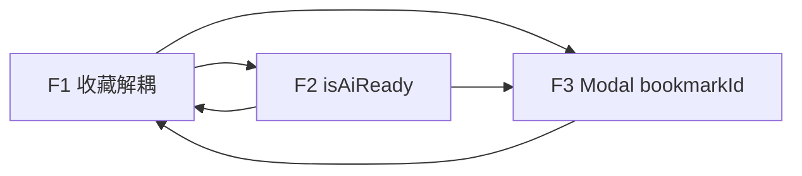

# AI 书签管家 v3.0 — 研发评审文档

| 字段 | 内容 |
|------|------|
| 文档版本 | v1.0 |
| 创建日期 | 2026-07-16 |
| 评审范围 | **v3.0 P0**：F1 + F2 + F3 |
| 前置 PRD | `AI书签管家_PRD_v3_体验打磨版.md` |
| 代码基线 | `bookmarkmind-ai/`（v2 已交付） |
| 目标读者 | 前端、Chrome 扩展、QA、产品 |

---

## 0. 评审结论（Executive Summary）

v3.0 三项 P0 **不需要架构重构**，本质是 **体验层修补 + 入口接线**。后端能力（`chrome.bookmarks.create`、标签 CRUD、模型列表下拉）大部分已存在，差距集中在：

1. **F1**：`BOOKMARK_CREATE` 仍 **同步等待 AI 分类**，导致用户感知「点了没反应 / 收藏失败」；Toast 未区分「收藏成功 / AI 失败」。
2. **F2**：模型下拉已实现，但 **引导文案、`isModelConfigured` 判定过宽**（有 Key 无 Model 仍视为已配置），用户路径未闭环。
3. **F3**：`TagManager`、标签筛选 Store **已实现但未挂载**；书签 Tab 缺标签 chips 与管理入口；面板底部「收藏此页」未走确认弹窗。

**建议 v3.0 总工作量**：约 **8～12 人日**（1 名熟悉代码的前端 / 扩展工程师，1～1.5 周）。

---

## 1. F1～F3 技术方案与现有代码差距

### 1.1 F1 — 收藏体验重构（P0）

#### PRD 目标态

```
单击悬浮球
  → Step 1: chrome.bookmarks.create（必须成功才显示「已收藏」）
  → Step 2: 若开启自动分类且 AI 可用 → 异步分类（失败静默）
  → Step 3: Toast 分级（全成功 / 部分成功 / 收藏失败）
```

#### 现有实现

| 层级 | 文件 | 现状 |
|------|------|------|
| 入口 | `content/components/FloatingBall/FloatingBall.tsx` | 单击发 `BOOKMARK_CREATE`，Toast 仅区分「已收藏并归入 XX」/「已快速收藏」/「收藏失败」 |
| 入口 | `content/components/FloatingPanel/PanelStatusBar.tsx` | 同上，直接快速收藏 |
| 入口 | `popup/Popup.tsx` | 发消息后无 Toast，无错误处理 |
| 路由 | `background/index.ts` → `case 'BOOKMARK_CREATE'` | **先 `createBookmark`，再 `await autoClassifyOnCreate`** |
| 分类 | `background/bookmarks/classify.ts` → `autoClassifyOnCreate` | AI 失败 catch 后返回 null，不抛错 |
| 开关 | `options/.../PersonalizationSection.tsx` | `app.autoClassify` Toggle 已存在 |
| 通信 | `shared/utils/chrome-api.ts` → `safeSendMessage` | 异常返回 `null`，UI 统一当失败 |

#### 核心差距

| # | 差距 | 严重度 | 说明 |
|---|------|--------|------|
| G1 | **收藏与 AI 未解耦** | 🔴 高 | `background/index.ts:214-237` 在 `createBookmark` 成功后 **同步 await** `autoClassifyOnCreate`。AI 超时（默认 30s）期间 content script 阻塞，用户以为「坏了」 |
| G2 | **Toast 无「部分成功」** | 🔴 高 | `classified=false` 时统一显示「已快速收藏」，未告知「智能分类暂不可用」 |
| G3 | **错误信息不透明** | 🟡 中 | Handler 异常时返回 `{ error: String(error) }`，UI 不解析，只显示「收藏失败」；可能含 `503` 等裸错误 |
| G4 | **`isModelConfigured` 过宽** | 🟡 中 | 仅有 API Key 即触发自动分类（见 `background/index.ts:693-698`），未校验 `model` 字段，易触发无效 AI 调用 |
| G5 | **多入口行为不一致** | 🟡 中 | Popup 无反馈；PanelStatusBar / FloatingBall 逻辑重复但未共享 helper |
| G6 | **`BookmarkSaveModal` bookmarkId 缺失** | 🟡 中 | 后台返回 `bookmark: node`，Modal 读 `bookmarkId`（`BookmarkSaveModal.tsx:95`），导致 **带标签/备注收藏时标签无法写入** |

#### 建议技术方案（最小改动）

```typescript
// background/index.ts — BOOKMARK_CREATE 伪代码
const node = await createBookmark(url, title, folderId);

// 立即返回，不阻塞
const response = {
  success: true,
  bookmark: node,
  bookmarkId: node.id,
  classified: false,
};

// fire-and-forget 异步分类（可选发 BOOKMARK_CLASSIFIED 通知更新 Toast）
if (!skipAutoClassify && config.app.autoClassify && isAiReady(config)) {
  void classifyAfterCreate(node.id, config.model, tabId);
}

return response;
```

```typescript
// 新增 shared/utils/bookmark-toast.ts — 统一 Toast 文案
type BookmarkCreateResult = {
  success: boolean;
  classified?: boolean;
  category?: string;
  aiFailed?: boolean;
  error?: string;
};

export function getBookmarkCreateToastMessage(result: BookmarkCreateResult): {
  type: 'success' | 'warning' | 'error';
  message: string;
} { /* PRD 三级文案 + 错误码映射 */ }
```

**错误码映射表（建议）**：

| 原始错误 | 用户文案 |
|----------|----------|
| HTTP 503 / Service Unavailable | AI 服务暂时不可用 |
| timeout / 连接超时 | AI 响应超时，书签已保存 |
| 无 API Key | （不触发 AI，无需提示） |
| chrome.bookmarks 权限/异常 | 收藏失败：无法写入 Chrome 书签 |

---

### 1.2 F2 — 模型配置引导闭环（P0）

#### PRD 目标态

- 测试成功 → 模型字段切换下拉（**已有**）
- 首次成功提示：「已检测到 N 个模型，请选择一个作为默认」
- 未选模型时，AI 入口提示「请先选择模型」，**不影响收藏**
- 帮助文案区分：「不配置 AI = 可以收藏；配置 AI = 智能分类和对话」

#### 现有实现

| 文件 | 现状 |
|------|------|
| `options/.../ModelConfigSection.tsx` | 有 OnboardingCard（仅无 Key 时）、测试结果 inline 展示 |
| `options/components/forms/ModelSelector.tsx` | 测试后有下拉 + 「已从服务商获取 N 个可用模型」 |
| `options/store/optionsStore.ts` | `testConnection` 拉模型列表；切换 provider 清空 `availableModels` ✅ |
| `content/store/contentStore.ts` | `isModelConfigured` 仅检查 Key / BaseURL |
| `content/components/ChatTab/ChatEmptyState.tsx` | 无 Key 时引导去设置，**未区分「有 Key 无 Model」** |

#### 核心差距

| # | 差距 | 说明 |
|---|------|------|
| G1 | 引导文案未按 PRD 验收 | ModelSelector 有弱提示，缺 ModelConfigSection 级 **Callout 强引导** |
| G2 | **`isModelConfigured` 语义错误** | 应拆为 `hasApiCredentials` vs `isAiReady`（credentials + model 已选） |
| G3 | 测试成功未自动聚焦模型字段 | 可选：自动展开下拉 / 预选第一个模型（需产品确认） |
| G4 | OnboardingCard 文案未强调「可不配 AI 收藏」 | 与 PRD U1 不一致 |

#### 建议技术方案

```typescript
// shared/utils/ai-config.ts（或 types 旁新建）
export function hasApiCredentials(config: ModelConfig): boolean { /* Key 或 custom baseUrl */ }
export function isAiReady(config: ModelConfig): boolean {
  return hasApiCredentials(config) && !!config.model?.trim();
}
```

- **收藏路径**：仅用 `isAiReady` 决定是否异步分类
- **Chat / 一键整理 / AI 搜索**：用 `isAiReady`；未就绪显示「请先选择模型」
- **PanelStatusBar「AI 已就绪」**：改为 `isAiReady` 判定

---

### 1.3 F3 — 标签体系产品化（P0）

#### PRD 目标态

| 入口 | 能力 |
|------|------|
| 书签 Tab 顶部 | 标签筛选 chips + **「管理标签」** |
| 书签详情 | 编辑标签 ✅ |
| 面板底部「收藏当前页」 | 打开确认弹窗（文件夹 + 标签 + 备注） |
| 设置页 | 迁移 `TagManager` 组件 |

#### 现有实现

| 文件 | 现状 |
|------|------|
| `content/store/tagStore.ts` | CRUD + `selectedTagIds` + `toggleTagSelection` ✅ |
| `content/components/TagManager/TagManager.tsx` | 完整管理 UI ✅ **但未在任何路由挂载** |
| `content/components/BookmarkTab/BookmarkTab.tsx` | 仅 **已有筛选时** 展示 TagChip 条，**无标签 chips 供点选** |
| `content/hooks/useBookmarks.ts` | **无标签筛选逻辑** |
| `content/components/FloatingPanel/PanelStatusBar.tsx` | 「收藏此页」→ 直接 `BOOKMARK_CREATE`，**未调 `showBookmarkSaveModal`** |
| `options/App.tsx` / `OptionsSidebar.tsx` | **无「标签管理」分区** |
| `background/bookmarks/classify.ts` | `suggestTagsForBookmark` 已实现 |
| `background/index.ts` → `AI_SUGGEST_CATEGORY` | **仅返回 category，未返回 tags** |
| `BookmarkSaveModal.tsx` | 写了 `suggestedTags` 但 **UI 未展示 AI 建议标签** |

#### 核心差距

| # | 差距 | 说明 |
|---|------|------|
| G1 | **TagManager 孤岛** | 组件存在，设置页 / 面板均未引用 |
| G2 | **标签筛选不可用** | `tagStore.selectedTagIds` 有状态，但 `useBookmarks` / `BookmarkList` 未过滤 |
| G3 | **缺「管理标签」入口** | PRD 要求 30 秒内可发现 |
| G4 | **面板收藏路径错误** | PRD：底部按钮应开 Modal，非快速收藏 |
| G5 | **AI 建议标签未接通** | 后端有能力，消息协议与 Modal UI 未接 |
| G6 | **BookmarkSaveModal bookmarkId** | 同 F1-G6，标签保存静默失败 |

#### 建议技术方案

1. **书签 Tab 顶部新增 `TagFilterBar` 组件**（或扩展 `SearchBar` 下方区域）
   - 展示 `tagStore.tags` 为 chips，点击 toggle 筛选
   - 右侧「管理标签」→ 打开 Modal 内嵌 `TagManager` 或跳转设置页 `#tags`

2. **标签筛选**：在 `useBookmarks` 或 `BookmarkList` 层
   ```typescript
   // 伪代码：选中 tagIds 后批量 TAG_GET_BOOKMARK_TAGS 或新增 TAG_FILTER_BOOKMARKS 消息
   filtered = bookmarks.filter(b => matchTagFilter(b.id, selectedTagIds, filterMode));
   ```
   建议新增 background 消息 `TAG_LIST_BOOKMARK_IDS` 避免 N+1 查询。

3. **设置页**：`SectionKey` 增加 `'tags'`，`OptionsSidebar` + `TagManagementSection.tsx`（薄包装 `TagManager`）

4. **PanelStatusBar**：未收藏时 `showBookmarkSaveModal({ url, title })`

5. **AI 建议标签（P0 可简化）**：扩展 `AI_SUGGEST_CATEGORY` 返回 `{ category, tags }` 或新建 `AI_SUGGEST_TAGS`；Modal 展示可点击 chips。

---

## 2. Story 拆分与开发任务（文件级 + 估点）

> 估点说明：**XS** ≤ 0.5d · **S** 1d · **M** 2～3d · **L** ≥ 5d

---

### F1 — 收藏体验重构

#### Story F1-1：收藏与 AI 分类解耦

| 任务 ID | 文件 | 改动要点 | 估点 |
|---------|------|----------|------|
| F1-1a | `background/index.ts` | `BOOKMARK_CREATE` 立即返回；分类改 fire-and-forget | M |
| F1-1b | `background/bookmarks/classify.ts` | 抽出 `classifyAfterCreate(id, config, { onDone })`；分类结果可选 `chrome.tabs.sendMessage` 通知 | S |
| F1-1c | `shared/types/index.ts` | 响应增加 `bookmarkId`、`aiStatus?: 'skipped' \| 'pending' \| 'done' \| 'failed'` | XS |
| F1-1d | `shared/utils/ai-config.ts`（新建） | `hasApiCredentials` / `isAiReady` | XS |

#### Story F1-2：Toast 分级与错误映射

| 任务 ID | 文件 | 改动要点 | 估点 |
|---------|------|----------|------|
| F1-2a | `shared/utils/bookmark-toast.ts`（新建） | 三级 Toast + 错误码 humanize | S |
| F1-2b | `content/components/FloatingBall/FloatingBall.tsx` | 使用统一 helper；监听可选 `BOOKMARK_CLASSIFIED` 更新文案 | S |
| F1-2c | `content/components/FloatingPanel/PanelStatusBar.tsx` | 同上 | XS |
| F1-2d | `popup/Popup.tsx` | 增加成功/失败 Toast 或 inline 状态 | XS |
| F1-2e | `content/store/contentStore.ts` | 可选：监听 background 分类完成 pushToast | S |

#### Story F1-3：修复 Modal 收藏 bookmarkId

| 任务 ID | 文件 | 改动要点 | 估点 |
|---------|------|----------|------|
| F1-3a | `background/index.ts` | 返回 `bookmarkId: node.id` | XS |
| F1-3b | `content/components/BookmarkSaveModal/BookmarkSaveModal.tsx` | 读 `response.bookmark?.id \|\| response.bookmarkId` | XS |

#### Story F1-4：自动分类开关可达性（验收补强）

| 任务 ID | 文件 | 改动要点 | 估点 |
|---------|------|----------|------|
| F1-4a | `options/.../PersonalizationSection.tsx` | 补充说明：「关闭后收藏不再调用 AI」 | XS |
| F1-4b | `options/.../ModelConfigSection.tsx` | 可选：链到个性化开关的锚点链接 | XS |

**F1 小计**：约 **4～5 人日**

---

### F2 — 模型配置引导闭环

#### Story F2-1：模型选择引导 UI

| 任务 ID | 文件 | 改动要点 | 估点 |
|---------|------|----------|------|
| F2-1a | `options/.../ModelConfigSection.tsx` | 测试成功后显示 Callout：「已检测到 N 个模型，请选择一个作为默认」 | S |
| F2-1b | `options/components/forms/ModelSelector.tsx` | 测试成功且 `!value` 时高亮/自动 focus 下拉 | XS |
| F2-1c | `options/store/optionsStore.ts` | 测试成功可选：若仅 1 个模型则自动写入 `model`（需产品确认） | XS |

#### Story F2-2：AI 就绪态统一

| 任务 ID | 文件 | 改动要点 | 估点 |
|---------|------|----------|------|
| F2-2a | `shared/utils/ai-config.ts` | 见 F1-1d | XS |
| F2-2b | `content/store/contentStore.ts` | `aiConfigured` 改为 `isAiReady`；新增 `hasApiCredentials` 可选 | S |
| F2-2c | `background/index.ts` | 所有 AI handler 用 `isAiReady` | S |
| F2-2d | `content/components/ChatTab/ChatEmptyState.tsx` | 区分「未配 Key」vs「请先选择模型」 | S |
| F2-2e | `content/components/FloatingPanel/PanelStatusBar.tsx` | 状态文案：AI 未配置 / 待选模型 / AI 已就绪 | XS |
| F2-2f | `content/components/BookmarkTab/BookmarkToolbar.tsx` | 一键整理提示对齐 | XS |

#### Story F2-3：帮助文案

| 任务 ID | 文件 | 改动要点 | 估点 |
|---------|------|----------|------|
| F2-3a | `options/.../ModelConfigSection.tsx` | OnboardingCard 改写：「不配置 AI 也可收藏；配置后可智能分类和对话搜索」 | XS |
| F2-3b | `options/.../PersonalizationSection.tsx` | 自动分类说明与 Model 配置关联 | XS |

**F2 小计**：约 **2～3 人日**（与 F1 共享 `ai-config.ts`）

---

### F3 — 标签体系产品化

#### Story F3-1：书签 Tab 标签筛选 + 管理入口

| 任务 ID | 文件 | 改动要点 | 估点 |
|---------|------|----------|------|
| F3-1a | `content/components/BookmarkTab/TagFilterBar.tsx`（新建） | 标签 chips + 「管理标签」按钮 | M |
| F3-1b | `content/components/BookmarkTab/BookmarkTab.tsx` | 挂载 TagFilterBar（CategoryTabs 下方） | XS |
| F3-1c | `content/hooks/useBookmarks.ts` | 接入 tag 筛选；监听 `tagStore.selectedTagIds` | M |
| F3-1d | `background/tags/crud.ts` + `background/index.ts` | 新增 `TAG_LIST_BOOKMARK_IDS` 或反向索引缓存 | M |

#### Story F3-2：设置页标签管理

| 任务 ID | 文件 | 改动要点 | 估点 |
|---------|------|----------|------|
| F3-2a | `options/store/optionsStore.ts` | `SectionKey` 增加 `'tags'` | XS |
| F3-2b | `options/components/OptionsSidebar.tsx` | 导航项「标签管理」 | XS |
| F3-2c | `options/components/sections/TagManagementSection.tsx`（新建） | 包装 `TagManager`，适配 options 样式 | S |
| F3-2d | `options/App.tsx` | 注册 section | XS |

#### Story F3-3：面板「收藏此页」走确认弹窗

| 任务 ID | 文件 | 改动要点 | 估点 |
|---------|------|----------|------|
| F3-3a | `content/components/FloatingPanel/PanelStatusBar.tsx` | 未收藏 → `showBookmarkSaveModal` | S |
| F3-3b | `content/App.tsx` | 确认已挂载 `BookmarkSaveModal` | XS |

#### Story F3-4：AI 建议标签（P0 最小版）

| 任务 ID | 文件 | 改动要点 | 估点 |
|---------|------|----------|------|
| F3-4a | `background/index.ts` | `AI_SUGGEST_CATEGORY` 改调 `suggestTagsForBookmark` 返回 tags | S |
| F3-4b | `content/components/BookmarkSaveModal/BookmarkSaveModal.tsx` | 展示 suggestedTags chips，点击加入 TagSelector | S |
| F3-4c | `background/ai/prompt.ts` | 约束标签 ≤5 字、2～3 个（若 prompt 未约束） | XS |

#### Story F3-5：书签列表展示标签（可选 P0）

| 任务 ID | 文件 | 改动要点 | 估点 |
|---------|------|----------|------|
| F3-5a | `content/components/BookmarkTab/BookmarkItem.tsx` | 标题旁 1～2 个 TagChip | S |
| F3-5b | `content/components/BookmarkTab/BookmarkList.tsx` | 批量加载 bookmarkTags | S |

**F3 小计**：约 **4～5 人日**（F3-5 可放 P0 末尾或 v3.0.1）

---

### v3.0 任务总览

| 功能 | 人日 | 优先级 |
|------|------|--------|
| F1 收藏体验 | 4～5 | P0 |
| F2 模型引导 | 2～3 | P0 |
| F3 标签产品化 | 4～5 | P0 |
| 联调 + 自测 | 1～2 | — |
| **合计** | **11～15** | — |

建议排期：**F1 → F2（并行 ai-config）→ F3**；F1 为阻塞项，应先 merge。

---

## 3. 依赖与风险

### 3.1 MV3 Service Worker

| 风险 | 影响 | 对策 |
|------|------|------|
| SW 空闲 30s 后终止 | 异步分类中途被 kill | F1 方案：**先返回再分类**；分类任务短于 25s 或拆为「创建书签 + 单次 classify API」 |
| 长时间 AI 请求 | `organizeScattered` 等仍可能超时 | v3.0 不动；v3.1 F4/F5 需 progress 消息 + alarm 续跑评估 |
| `sendResponse` 异步通道 | 若仍 sync await AI，channel 可能超时 | F1 解耦后消除 |
| SW 唤醒失败 | `safeSendMessage` 返回 null | UI 提示「扩展未响应，请刷新页面」而非「收藏失败」 |

### 3.2 chrome.bookmarks API

| 风险 | 影响 | 对策 |
|------|------|------|
| 重复 URL | `createBookmark` 不检查重复，可能创建多条 | v3.0 可选：`checkBookmarked` 前置；或 create 后 dedupe（非必须） |
| 大量书签性能 | `getAllBookmarks` 全量拉取 | v3.0 不涉及；F4 批量治理需按时间窗口查询 |
| 文件夹 ID 国际化 | 书签栏 id=`1`、其他=`2` 硬编码 | 现有 `findBookmarksBarFolder` 已处理多语言，沿用 |
| 回收站 + removeTree | 删除逻辑已封装在 `crud.ts` | F4 删除治理直接复用 `batchDelete` |

### 3.3 跨模块依赖



- **F1/F2 共享** `shared/utils/ai-config.ts`，应同 PR 或 F1 先发
- **F3 标签筛选** 依赖 background 标签索引（新建消息或 storage 缓存）
- **设计/产品**：Toast 文案、Callout 文案需定稿（非阻塞开发）

### 3.4 开放问题（研发视角）

| PRD 问题 | 研发建议 |
|----------|----------|
| Q1 单击是否改弹窗 | **保持快速收藏**；仅 PanelStatusBar「收藏此页」开 Modal |
| Q3 历史归档系统文件夹 | v3.0 不做；F5 预留常量 `ARCHIVE_FOLDER_NAME` |
| Q4 上架前隐藏 Tab | 与 v3.0 独立，可用 feature flag |

---

## 4. 不建议做的过度工程

| 不建议 | 原因 | 推荐替代 |
|--------|------|----------|
| 重构消息总线为 RPC / tRPC | v3 范围是体验修复 | 继续 `ExtMessage` + switch |
| 引入 Job Queue（Bull / 自研）做 AI 任务 | MV3 无持久 Worker | fire-and-forget + 可选 tab 通知 |
| 收藏链路 Event Sourcing | 无多端同步需求 | 直接改 `BOOKMARK_CREATE` 返回值 |
| 标签系统改图数据库 / 全文索引 | 书签量级 < 5000 | chrome.storage + 内存 Map |
| 单击改双击/长按才快速收藏 | 违背 PRD Q1 | 保持现状 |
| F5 内容类型在 v3.0 提前做 | 范围膨胀 | 严格放 v3.1 |
| 为 Toast 建独立全局 Store | 已有 `contentStore.pushToast` | 抽纯函数 helper 即可 |
| 统一 FloatingBall / Popup / Panel 为单一 Hook 框架 | 收益小 | 仅抽 `useQuickBookmark()` 50 行 |
| 申请或使用 `history` 做删除建议 | PRD v3 不做 | F4 仅按 `dateAdded` |

---

## 5. 验收测试要点（研发自测）

### 5.1 F1 收藏体验

| # | 场景 | 步骤 | 预期 |
|---|------|------|------|
| T1 | 无 API Key 快速收藏 | 清空配置 → 单击悬浮球 | ≤1s 出现「已收藏」；Chrome 书签栏有记录 |
| T2 | 有 Key 无 Model | 填 Key 不选模型 → 单击悬浮球 | 立即成功；不调 AI；Toast 无 503 |
| T3 | AI 503 | Mock provider 返回 503 | 书签已创建；Toast「已收藏（智能分类暂不可用）」 |
| T4 | AI 超时 | Mock 35s 延迟 | 收藏 ≤2s 完成；分类后台失败不影响 |
| T5 | 关闭自动分类 | 个性化关闭 → 收藏 | 无 AI 网络请求（DevTools 验证） |
| T6 | 重复收藏 | 同 URL 再点 | 取消收藏或提示已存在（按产品定） |
| T7 | Modal 带标签 | 面板收藏 → 选标签确认 | 标签写入成功；Bookmark Tab 可筛到 |
| T8 | SW 杀进程 | 收藏后立刻 chrome://serviceworker 停 SW | 书签仍在；分类可失败但不 crash |
| T9 | Popup 兜底 | 禁用 content script 页面用 Popup | 有明确成功/失败反馈 |

### 5.2 F2 模型引导

| # | 场景 | 预期 |
|---|------|------|
| T1 | 测试连接成功 | 5s 内见模型下拉 + 引导文案 |
| T2 | 切换服务商 | 旧模型列表清空 |
| T3 | 有 Key 无 Model 打开 Chat | 「请先选择模型」+ 跳转设置 |
| T4 | 选 Model 后 | Panel 显示「AI 已就绪」 |
| T5 | 无 Key 收藏 | 正常收藏；Chat 仍引导配置 |

### 5.3 F3 标签

| # | 场景 | 预期 |
|---|------|------|
| T1 | 发现管理入口 | 书签 Tab 30s 内找到「管理标签」 |
| T2 | 设置页管理 | CRUD / 合并 / 删除正常 |
| T3 | 标签筛选 | 选 tag chip → 列表仅含该书签 |
| T4 | 面板收藏 | 点「收藏此页」→ 弹窗非快速收藏 |
| T5 | 详情编辑标签 | 已有能力回归 |
| T6 | AI 建议标签 | Modal 显示 2～3 建议（AI 可用时） |

### 5.4 回归清单

- [ ] 一键整理 / 对话搜索 / 时间轴只读 / 清理中心 / 再发现 — 无 regression
- [ ] 快捷键 Alt+S 收藏路径与 F1 一致
- [ ] 扩展 reload 后配置与标签数据持久化

---

## 6. v3.1 F4～F5 粗略工作量

> v3.1 范围：F4 时间轴治理 + F5 智能分类 v2 + F6 首次引导（PRD §13）

### F4 — 时间轴治理工具栏（P1）

| 模块 | 主要文件 | 工作项 | 估点 |
|------|----------|--------|------|
| UI | `TimelineTab/TimelineTab.tsx`、`TimelineGovernanceBar.tsx`（新） | 归档/删除/分组切换/无标签筛选 | M |
| 逻辑 | `content/hooks/useTimeline.ts` | 按时间窗口筛选、`dateAdded` 计算 N 年前 | M |
| 后台 | `background/bookmarks/crud.ts`、`background/index.ts` | 批量归档到「历史归档」、批量删除走回收站 | M |
| 弹窗 | `content/components/Modal/ConfirmModal.tsx` | 二次确认 + 数量预览 + 导出 CSV 入口 | S |
| 安全 | 复用 `batchDelete` + recycleBin | 归档优先 UI 默认高亮 | S |

**F4 小计**：约 **5～7 人日**

### F5 — 智能分类 v2（P1）

| 模块 | 主要文件 | 工作项 | 估点 |
|------|----------|--------|------|
| 类型识别 | `shared/utils/content-type.ts`（新） | 规则表：GitHub / 文章 / 文档 / 视频 / 工具 | M |
| UI | `BookmarkItem.tsx`、`TimelineGroup.tsx` | 类型图标，不建类型文件夹 | M |
| 分类策略 | `background/bookmarks/classify.ts` | 文件夹 6～10 上限；GitHub 不单独建夹；置信度 ≥0.7 新建 | L |
| 老书签 | `useTimeline.ts` / 新提示条 | 「可归档 N 个」+ 一键移入历史归档 | M |
| 设置 | `DataManagementSection` 或 Category | 历史归档重命名/清空 | S |

**F5 小计**：约 **8～12 人日**（置信度最高低，建议 spike 1d 后重估）

### F6 — 首次引导（P1，简述）

| 工作项 | 估点 |
|--------|------|
| 3 步引导 Modal + storage 标记 + 设置页重开 | S～M（2～3 人日） |

### v3.1 汇总

| 版本 | 范围 | 人日 | 日历（1 人） |
|------|------|------|--------------|
| v3.0 | F1+F2+F3 | 11～15 | 1.5～2 周 |
| v3.1 | F4+F5+F6 | 15～22 | 2.5～3.5 周 |
| **累计** | — | **26～37** | **约 1.5 月** |

---

## 7. 附录：关键代码索引

| 主题 | 路径 |
|------|------|
| 收藏入口 | `src/content/components/FloatingBall/FloatingBall.tsx` |
| 收藏路由 | `src/background/index.ts` L214-237 |
| 书签 CRUD | `src/background/bookmarks/crud.ts` |
| AI 分类 | `src/background/bookmarks/classify.ts` |
| 标签 Store | `src/content/store/tagStore.ts` |
| 标签管理 UI | `src/content/components/TagManager/TagManager.tsx` |
| 模型配置 | `src/options/components/sections/ModelConfigSection.tsx` |
| 时间轴 | `src/content/components/TimelineTab/TimelineTab.tsx` |
| 类型定义 | `src/shared/types/index.ts` |

---

## 8. 评审检查清单（研发侧）

- [ ] 是否同意 F1 **异步分类 + 立即返回** 为 v3.0 第一技术决策？
- [ ] `isAiReady` 与 `hasApiCredentials` 拆分是否认可？
- [ ] F3 标签筛选：**新 background 消息** vs **前端全量拉取** — 书签量 >2000 时选前者
- [ ] F3-5 列表展示标签是否纳入 v3.0 还是 v3.0.1？
- [ ] Toast / Callout 文案由产品定稿时间点？
- [ ] v3.0 完成后是否安排 Chrome Web Store 功能裁剪（Q4）？

---

*本文档由研发视角撰写，供 v3.0 排期与评审使用。产品细节以 PRD v3 为准；实现时遵循「最小 diff、不大重构」原则。*
